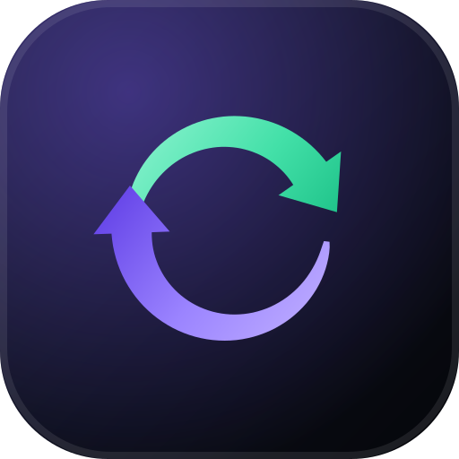

<div align="center">
  
  <h1>Dena-Paona</h1>
  <p><strong>A calm, private ledger for money between friends and family.</strong></p>
  <p>দেনা (what you owe) · পাওনা (what you're owed)</p>
</div>

---

## What it does

- **Two sides, one ledger.** Every entry is either a *dena* (you owe) or a *paona* (you're owed), each with its own page and running total.
- **One number that matters.** A live net position across everything still open.
- **Partial settlement.** Record part payments; entries close themselves once fully paid.
- **Due dates.** Anything past its date is flagged as overdue.
- **Read-only sharing.** Grant another registered user a view of your wallet by email. They can see everything; only you can change it. Revoke any time.
- **Google sign-in only.** No passwords and no other way to create an account. Sign-up and sign-in are the same flow.

## Stack

| Layer | Choice |
| --- | --- |
| Framework | Next.js 16 (App Router, Server Actions, Turbopack) |
| Database | Neon Postgres via `@prisma/adapter-neon` |
| ORM | Prisma 7 |
| Styling | Tailwind CSS v4 (CSS-first `@theme` tokens) |
| Motion | Motion (Framer Motion v13) |
| Auth | Better Auth — Google OAuth only |
| Hosting | Vercel |

## Getting started

### 1. Install

```bash
npm install
```

### 2. Start a local database

Development uses a local Postgres; the Neon database is production only.

```bash
brew install postgresql@17
brew services start postgresql@17
createdb dena_paona_dev
```

(For production, make a Neon project at [neon.tech](https://neon.tech) and use its **direct**
connection string in Vercel. If you'd rather use the pooled `-pooler` URL, put that in
`DATABASE_URL` and the direct one in `DIRECT_URL`.)

### 3. Configure environment

```bash
cp .env.example .env.local
```

Fill in every variable — `.env.example` says where each one comes from. Without the
Google pair the sign-in button stays disabled, and nobody can sign in.

### 4. Create the tables

```bash
npm run db:migrate
```

Applies the checked-in migrations in `prisma/migrations/`.

### 5. Run

```bash
npm run dev
```

Open [localhost:3000](http://localhost:3000).

### Optional: demo data

Creates two linked accounts with entries and a share between them.

```bash
npm run seed
```

Sign-in is Google-only, so pass your own Google email to sign in as Ayesha:

```bash
SEED_EMAIL=you@gmail.com npm run seed
```

Ayesha has granted Rahim read-only access to her wallet. The seed refuses to run
against Neon (production).

## Deploying to Vercel

1. Push this repo to GitHub.
2. Import it at [vercel.com/new](https://vercel.com/new) — the Next.js preset is detected automatically, no `vercel.json` needed.
3. Add the environment variables from `.env.example` to **Production** (and
   **Preview** if you use it). Set `BETTER_AUTH_URL` to the deployment's URL.
4. In Google Cloud Console, add `https://<your-domain>/api/auth/callback/google`
   as an authorised redirect URI.
5. Deploy.

You can also attach Neon straight from the Vercel Marketplace
(**Storage → Neon**), which injects `DATABASE_URL` for you.

With the Vercel CLI:

```bash
npm i -g vercel
vercel link
vercel env add DATABASE_URL
vercel env add BETTER_AUTH_SECRET
vercel env add BETTER_AUTH_URL
vercel env add GOOGLE_CLIENT_ID
vercel env add GOOGLE_CLIENT_SECRET
vercel deploy --prod
```

> Run migrations against the production database before deploying a schema change,
> or the app will error on its first query:
> `DATABASE_URL="$PROD_DATABASE_URL" npx prisma migrate deploy`

## Project layout

```
src/
  app/
    (auth)/          /login (Google only), shared split-screen layout
    api/auth/        Better Auth's route handler
    app/             the authenticated product
      dena/          money you owe
      paona/         money owed to you
      shared/        grant access, and browse wallets shared with you
        [ownerId]/   read-only view of someone else's wallet
    fonts/           self-hosted Inter + Sora subsets
    icon.svg         favicon (generated)
  components/
    app/             product surfaces — ledger, cards, summaries, sharing
    landing/         marketing page sections
    motion/          shared animation primitives and easing language
    ui/              button, field, modal, toast
  lib/
    better-auth.ts   auth config: Google provider, sessions, rate limits
    auth.ts          getCurrentUser / requireUser — the server-side gate
    prisma.ts        lazily-connected Prisma client (Neon adapter)
  proxy.ts           redirects signed-out visitors away from /app
  server/
    actions/         server actions (sign-out, entries, shares)
    queries.ts       read paths, including the share authorisation gate
prisma/
  schema.prisma      the data model
  migrations/        checked-in SQL migrations
scripts/
  generate-icons.mjs single source of truth for the logo and every icon
  seed.mjs           optional demo data
```

## Notes on the design

- **Motion is a system, not decoration.** Two easing curves and two springs are
  defined once in `src/components/motion/primitives.tsx` and reused everywhere,
  so page transitions, list reordering, counters and the nav indicator all move
  with the same personality.
- **Everything respects `prefers-reduced-motion`.** Animations collapse to
  instant state changes rather than being merely faster.
- **The logo is generated.** `scripts/generate-icons.mjs` computes the mark's
  tapered arc geometry and emits the SVG, PNGs, maskable icon and `.ico`, and the
  same path data is injected into the React component — so the favicon and the
  in-app logo can never drift apart. Re-run with `npm run icons`.

## Security model

- Google is the only way to create an account or sign in. No passwords are stored.
- Auth endpoints are rate-limited per IP, with counters in Postgres so limits hold
  across serverless instances.
- Sessions live in the `sessions` table behind an httpOnly cookie, valid 30 days;
  signing out deletes the row. `proxy.ts` bounces signed-out visitors early, and
  every page and server action re-validates the session server-side.
- **Every** mutation is scoped by `ownerId` taken from the session — never from
  the request body.
- Shared wallets are read through `getAuthorisedWalletOwner()`, which returns a
  row only when a `wallet_shares` grant exists. There is no write path that a
  viewer can reach.
